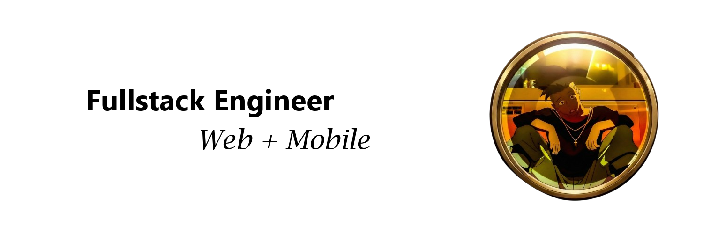

<picture>
  <source media="(prefers-color-scheme: dark)" srcset="./assets/banner_dark_mode.png" />
  <source media="(prefers-color-scheme: light)" srcset="./assets/banner_light_mode.png" />
  
</picture>

&nbsp;

  

   

  

    "The street finds its own uses for things." — and I build them.
  

&nbsp;&nbsp;

<table>
  <tr>
    <td width="50%" valign="bottom" align="center">
      
    </td>
    <td width="50%" valign="bottom" align="center">
      
    </td>
  </tr>
</table>
