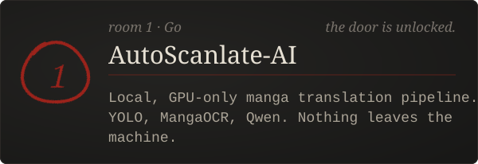
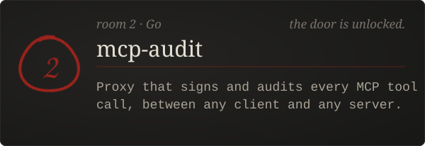
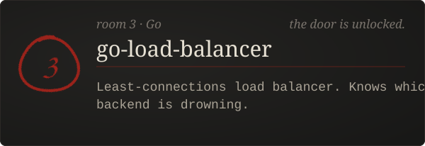
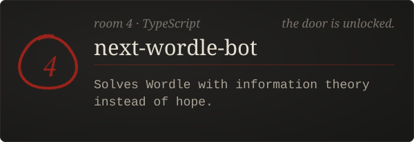
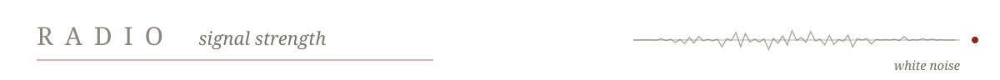
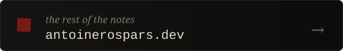
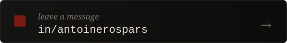

<picture>
  <source media="(prefers-color-scheme: light)" srcset="./assets/header-light.svg">
  
</picture>

 

<picture>
  <source media="(prefers-color-scheme: light)" srcset="./assets/footer-light.svg">
  
</picture>

