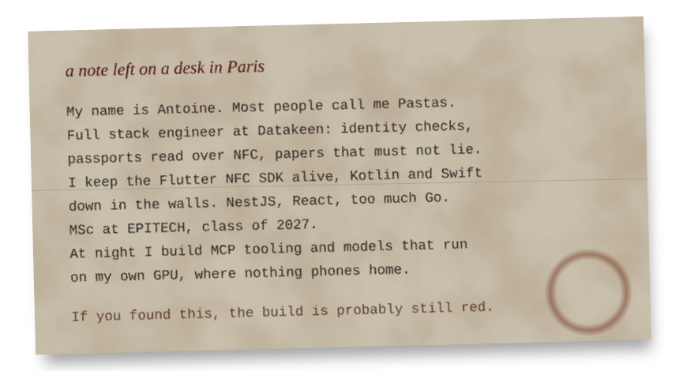

 

  

### <samp>tools found along the way</samp>

### <samp>rooms still unlocked</samp>

| | |
|:--|:--|
| [**AutoScanlate-AI**](https://github.com/P4ST4S/AutoScanlate-AI) | <samp>Local, GPU-only manga translation pipeline. YOLO, MangaOCR, Qwen. Nothing leaves the machine.</samp> |
| [**mcp-audit**](https://github.com/P4ST4S/mcp-audit) | <samp>Go proxy that signs and audits every MCP tool call, between any client and any server.</samp> |
| [**go-load-balancer**](https://github.com/P4ST4S/go-load-balancer) | <samp>Least-connections load balancer in Go. Knows which backend is drowning.</samp> |
| [**next-wordle-bot**](https://github.com/P4ST4S/next-wordle-bot) | <samp>Solves Wordle with information theory instead of hope.</samp> |

### <samp>signal strength</samp>

 

